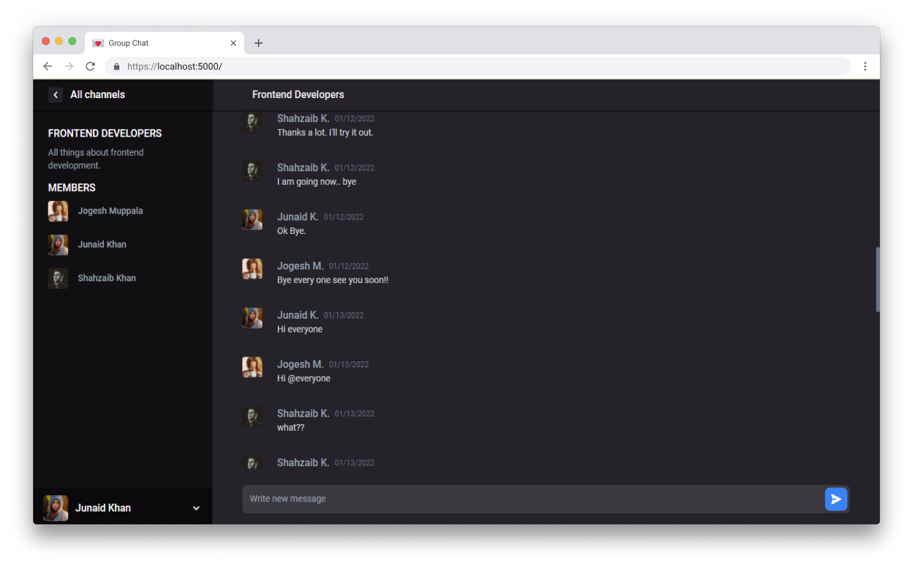

<h1 align="center">Group Chat</h1>

## Table of Contents

- [Overview](#overview)
  - [Built With](#built-with)
- [Features](#features)
- [How to use](#how-to-use)
- [Contact](#contact)

<!-- OVERVIEW -->

## Overview



Group Chat is a real time group chat webapp built using modern web technologies. I did this project while learning, Full stack Web Development with Javascript. The design of this project is from one of the challenges at devchallenges.io. This project also completes all of the user stories of this challenge. 

### Built With

<!-- This section should list any major frameworks that you built your project using. Here are a few examples.-->

- [Express](https://expressjs.com/)
- [Mongoose](https://mongoosejs.com/)
- [Socket.io](https://socket.io/)
- [React](https://reactjs.org/)
- [Redux](https://redux.js.org/)
- [Tailwind](https://tailwindcss.com/)

## Features

<!-- List the features of your application or follow the template. Don't share the figma file here :) -->
- RESTful API with Express
- API Authentication and Authorization
- Realtime messages using Socket.io
- Responsive Design


## How To Use

<!-- Example: -->

To clone and run this application, you'll need [Git](https://git-scm.com) and [Node.js](https://nodejs.org/en/download/) (which comes with [npm](http://npmjs.com)) installed on your computer. From your command line:

```bash
# Clone this repository
$ git clone https://github.com/your-user-name/your-project-name

# Install server dependencies
$ cd server
$ npm install

# Install frontend dependencies
$ cd frontend
$ npm install

# goto `server/config/index.js` and update the MONGO_URL constant

# Run the server
$ cd server
$ npm start

# goto `frontend/src/constants/api.js` and update `BASE_URL` to match the server path, and then

# Run the frontend client
$ cd frontend
$ npm start
```


## Contact

- LinkedIn [ehtishamhassan9](https://linkedin.com/in/ehtishamhassan9)
- Twitter [@ehtishamhassan9](https://twitter.com/ehtishamhassan9)
- GitHub [@ehtishama](https://github.com/ehtishama)
